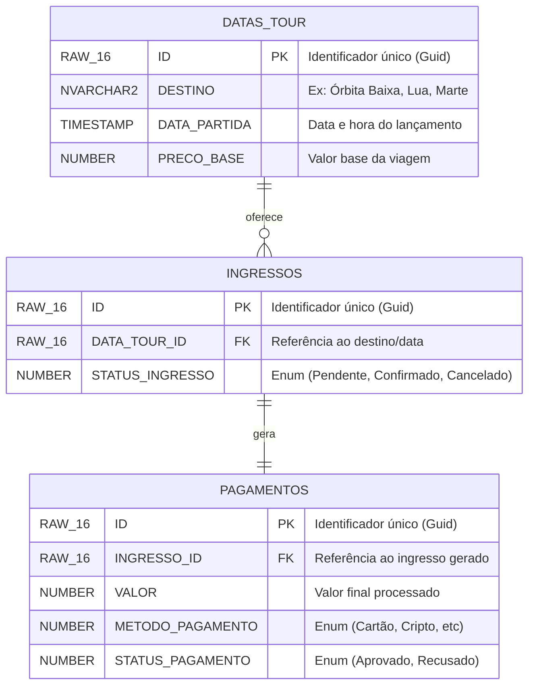

# OrbitPass — Módulo de Ingressos e Pagamentos

> **FIAP — Global Solution 2026/1 | 2º Ano — Análise e Desenvolvimento de Sistemas**  
> Tema: O Espaço é a Nova Fronteira — Economia Espacial

API REST complementar do projeto **OrbitPass**, responsável pelo módulo de **Ingressos e Pagamentos** de uma plataforma de turismo espacial. Construída com ASP.NET Core, Clean Architecture, persistência Oracle via Entity Framework Core e autenticação JWT.

### Integrantes do Grupo
* **Jhonatta Lima Sandes de Oliveira** - RM: 560277
* **Rangel Bernadi Jordão** - RM: 560547
* **Lucas José Lima** - RM: 561160

**Turma:** 2TDSPA

---

## Por que Economia Espacial?

O turismo espacial é um mercado emergente e real — empresas como SpaceX, Blue Origin e Virgin Galactic já oferecem ou planejam oferecer experiências espaciais para civis. Porém, não existe ainda uma plataforma centralizada, acessível e inteligente para gerenciar reservas e auxiliar o cliente na escolha da melhor experiência.

O **OrbitPass** resolve isso conectando diretamente ao tema da Global Solution 2026/1: a **Economia Espacial**. Este repositório cobre o módulo de backend responsável pela compra, confirmação e cancelamento de ingressos para tours espaciais.

**ODS atendidos:**
- **ODS 8** — Trabalho Decente e Crescimento Econômico: novo modelo de negócio no setor espacial emergente
- **ODS 9** — Indústria, Inovação e Infraestrutura: uso de tecnologias avançadas (Clean Architecture, Oracle, JWT)
- **ODS 11** — Cidades e Comunidades Sustentáveis: plataforma digital conectando pessoas a experiências de alto valor tecnológico


---

## Stack Técnica

| Camada | Tecnologia |
|---|---|
| Runtime | .NET 9.0 |
| Framework Web | ASP.NET Core 9 — Controllers |
| ORM | Entity Framework Core 9 + Oracle.EntityFrameworkCore 9 |
| Banco de Dados | Oracle Database (FIAP) |
| Autenticação | JWT Bearer (HMAC-SHA256) |
| Documentação | Swagger / Swashbuckle.AspNetCore |
| Testes | xUnit + FluentAssertions + Moq |
| Health Checks | AspNetCore.HealthChecks.Oracle |

---

## Arquitetura

O projeto segue os princípios de **Clean Architecture** com separação estrita em quatro camadas. As camadas internas nunca conhecem as externas.

```
┌─────────────────────────────────────────────┐
│              OrbitPass.Api                  │
│   Controllers · Middlewares · Extensions   │
└───────────────────┬─────────────────────────┘
                    │
        ┌───────────┴───────────┐
        ▼                       ▼
┌───────────────────┐  ┌────────────────────────┐
│OrbitPass.Applic.  │  │OrbitPass.Infrastructure│
│  Use Cases        │  │  EF Core · Oracle      │
│  Commands/Queries │  │  Repositories          │
│  DTOs · Handlers  │  │  DependencyInjection   │
└───────┬───────────┘  └────────────────────────┘
        │
        ▼
┌───────────────────┐
│  OrbitPass.Domain │
│  Entities · Enums │
│  Interfaces       │
│  Exceptions       │
└───────────────────┘
```

---

## Diagrama de Entidades (MER)

O modelo de dados foi estruturado seguindo os princípios de **Clean Architecture** e mapeado utilizando **Entity Framework Core** para um banco de dados **Oracle**. 

A arquitetura de dados reflete o domínio de negócio da **OrbitPass** (Turismo Espacial), cumprindo todos os requisitos de integridade relacional, incluindo relacionamentos `1:N` e `1:1`.



### Dicionário de Dados

Enquanto o diagrama acima ilustra a topologia e os relacionamentos principais, o dicionário de dados abaixo detalha a estrutura física completa (DDL) implementada no Oracle, incluindo colunas de auditoria e regras de negócio:

#### Tabela INGRESSOS

| Coluna | Tipo | Descrição |
|---|---|---|
| ID | RAW(16) | Chave primária (GUID) |
| USUARIO_ID | RAW(16) | ID do usuário comprador |
| DATA_TOUR_ID | RAW(16) | ID da data do tour espacial |
| CODIGO_UNICO | VARCHAR2(40) | Código único (ex: `OP-20260603-A1B2C3D4`) |
| STATUS | NUMBER(1) | 1=PendentePagamento · 2=Confirmado · 3=Cancelado |
| DATA_COMPRA | TIMESTAMP | Data e hora da compra (UTC) |
| VALOR_PAGO | NUMBER(10,2) | Valor pago pelo ingresso |

#### Tabela PAGAMENTOS

| Coluna | Tipo | Descrição |
|---|---|---|
| ID | RAW(16) | Chave primária (GUID) |
| INGRESSO_ID | RAW(16) | FK para INGRESSOS — relacionamento 1:1 |
| METODO | NUMBER(1) | 1=CartaoCredito · 2=CartaoDebito · 3=Pix · 4=Transferencia |
| STATUS | NUMBER(1) | 1=Processando · 2=Aprovado · 3=Recusado |
| DATA_PAGAMENTO | TIMESTAMP | Data e hora do pagamento (UTC) |
| VALOR | NUMBER(10,2) | Valor do pagamento |

---

## Pré-requisitos

- [.NET 9.0 SDK](https://dotnet.microsoft.com/download/dotnet/9.0)
- Acesso ao Oracle Database (FIAP ou local)
- `dotnet-ef`: `dotnet tool install --global dotnet-ef --version 9.0.0`

---

## Configuração

### 1. Clone o repositório

```bash
git clone https://github.com/seu-usuario/OrbitPass.git
cd OrbitPass
```

### 2. Configure o ambiente local

Copie o arquivo de exemplo e preencha com seus dados reais:

```bash
cp src/OrbitPass.Api/appsettings.Development.example.json \
   src/OrbitPass.Api/appsettings.Development.json
```

Edite o `appsettings.Development.json`:

```json
{
  "ConnectionStrings": {
    "OracleDb": "User Id=SEU_RM;Password=SUA_SENHA;Data Source=HOST:1521/SERVICE;"
  },
  "Jwt": {
    "SecretKey": "SuaChaveSecretaComMinimoVinteEQuatroCaracteres!"
  }
}
```

> ⚠️ O arquivo `appsettings.Development.json` está no `.gitignore` e **nunca é commitado**.
> Em produção e CI/CD, use as variáveis de ambiente `ORACLE_CONNECTION_STRING` e `JWT_SECRET_KEY`.

### 3. Aplique as Migrations

```bash
dotnet ef database update \
  --project src/OrbitPass.Infrastructure \
  --startup-project src/OrbitPass.Api
```

### 4. Execute a API

```bash
dotnet run --project src/OrbitPass.Api
```

Após iniciar:

| URL | Descrição |
|---|---|
| `http://localhost:5225/swagger` | Documentação interativa Swagger/OpenAPI |
| `http://localhost:5225/health` | Health Check da API e do banco Oracle |

---

## API Reference

Rotas consumidas via HTTP, retornam JSON. Documentadas interativamente em `/swagger`.

#### Autenticação

| Método | Rota | Descrição | Auth |
| :---: | :--- | :--- | :---: |
| `POST` | `/api/Auth/token` | Autentica e retorna token JWT | ❌ |

**Credenciais disponíveis para teste:**

| Email | Senha | Permissões |
|---|---|---|
| `teste@orbitpass.com` | `Senha@123` | Acesso completo à API |

**Exemplo de resposta:**
```json
{
  "token": "eyJhbGciOiJIUzI1NiIsInR5cCI6IkpXVCJ9..."
}
```

> Para autenticar no Swagger, clique em **Authorize** e informe `Bearer {token}`.

---

#### Ingressos

| Método | Rota | Descrição | Auth |
| :---: | :--- | :--- | :---: |
| `POST` | `/api/ingressos` | Compra um ingresso e processa o pagamento automaticamente | ✅ |
| `GET` | `/api/ingressos/usuario/{usuarioId}` | Lista todos os ingressos de um usuário | ✅ |
| `DELETE` | `/api/ingressos/{ingressoId}/usuario/{usuarioId}` | Cancela um ingresso ativo | ✅ |

**Corpo da requisição para `POST /api/ingressos`:**

| Campo | Tipo | Valores aceitos |
|---|---|---|
| `usuarioId` | `guid` | ID do usuário comprador |
| `dataTourId` | `guid` | ID da data do tour espacial |
| `valorPago` | `decimal` | Valor positivo |
| `metodo` | `int` | `1` CartaoCredito · `2` CartaoDebito · `3` Pix · `4` Transferencia |

**Exemplo de requisição:**
```json
{
  "usuarioId": "3fa85f64-5717-4562-b3fc-2c963f66afa6",
  "dataTourId": "4fa85f64-5717-4562-b3fc-2c963f66afa7",
  "valorPago": 1500.00,
  "metodo": 3
}
```

**Exemplo de resposta `201 Created`:**
```json
{
  "ingressoId": "a1b2c3d4-...",
  "codigoUnico": "OP-20260603-A1B2C3D4",
  "statusIngresso": 2,
  "pagamentoId": "e5f6g7h8-...",
  "statusPagamento": 2
}
```

| Campo | Valor | Significado |
|---|:---:|---|
| `statusIngresso` | `1` | PendentePagamento |
| `statusIngresso` | `2` | Confirmado |
| `statusIngresso` | `3` | Cancelado |
| `statusPagamento` | `1` | Processando |
| `statusPagamento` | `2` | Aprovado |
| `statusPagamento` | `3` | Recusado |

---

#### Pagamentos

| Método | Rota | Descrição | Auth |
| :---: | :--- | :--- | :---: |
| `POST` | `/api/pagamentos` | Processa o pagamento de um ingresso pendente | ✅ |

**Corpo da requisição para `POST /api/pagamentos`:**
```json
{
  "ingressoId": "a1b2c3d4-...",
  "metodo": 1,
  "valor": 1500.00
}
```

---

#### Monitoramento

| Método | Rota | Descrição |
| :---: | :--- | :--- |
| `GET` | `/health` | Verifica saúde da API e conectividade com o Oracle |
| `GET` | `/swagger` | Documentação interativa Swagger/OpenAPI |

---

## Como Usar (Fluxo Completo)

### 1. Gerar o token JWT

```bash
POST /api/Auth/token
{
  "email": "teste@orbitpass.com",
  "senha": "Senha@123"
}
```

### 2. Autorizar no Swagger

Clique em **Authorize** e informe:  
```Bearer {token}```

### 3. Comprar um ingresso

```bash
POST /api/ingressos
{
  "usuarioId": "3fa85f64-5717-4562-b3fc-2c963f66afa6",
  "dataTourId": "4fa85f64-5717-4562-b3fc-2c963f66afa7",
  "valorPago": 1500.00,
  "metodo": 3
}
```

**Valores válidos para `metodo`:** `1` CartaoCredito · `2` CartaoDebito · `3` Pix · `4` Transferencia

**Resposta:**
```json
{
  "ingressoId": "a1b2c3d4-...",
  "codigoUnico": "OP-20260603-A1B2C3D4",
  "statusIngresso": 2,
  "pagamentoId": "e5f6g7h8-...",
  "statusPagamento": 2
}
```

### 4. Listar ingressos do usuário

```bash
GET /api/ingressos/usuario/3fa85f64-5717-4562-b3fc-2c963f66afa6
Authorization: Bearer {token}
```

### 5. Cancelar um ingresso

```bash
DELETE /api/ingressos/{ingressoId}/usuario/{usuarioId}
Authorization: Bearer {token}
```

Retorna `204 No Content` em caso de sucesso.

---

## Tratamento de Erros

Todas as exceções são capturadas pelo `ExceptionHandlingMiddleware` e retornam um envelope JSON padronizado. Nunca é exposto stack trace ou mensagem interna ao cliente.

### Formato padrão de erro

```json
{
  "status": 422,
  "tipo": "Regra de negócio",
  "mensagem": "Ingresso já está cancelado.",
  "timestamp": "2026-06-03T12:00:00Z"
}
```

### Mapeamento de exceções

| Exceção | HTTP Status | `tipo` | Exemplo de cenário |
|---|:---:|---|---|
| `DomainException` | `422 Unprocessable Entity` | `Regra de negócio` | Cancelar ingresso já cancelado · Pagamento duplicado |
| `KeyNotFoundException` | `404 Not Found` | `Recurso não encontrado` | Buscar ingresso com ID inexistente |
| Token JWT ausente ou inválido | `401 Unauthorized` | — | Acessar endpoint protegido sem autenticar |
| Qualquer outra exceção | `500 Internal Server Error` | `Erro interno` | Falha inesperada de infraestrutura |

### Exemplos por cenário

**Tentativa de cancelar um ingresso já cancelado — `422`:**
```json
{
  "status": 422,
  "tipo": "Regra de negócio",
  "mensagem": "Ingresso já está cancelado.",
  "timestamp": "2026-06-03T12:00:00Z"
}
```

**Tentativa de cancelar ingresso de outro usuário — `422`:**
```json
{
  "status": 422,
  "tipo": "Regra de negócio",
  "mensagem": "Você não tem permissão para cancelar este ingresso.",
  "timestamp": "2026-06-03T12:00:00Z"
}
```

**Ingresso não encontrado — `404`:**
```json
{
  "status": 404,
  "tipo": "Recurso não encontrado",
  "mensagem": "Ingresso a1b2c3d4-... não encontrado.",
  "timestamp": "2026-06-03T12:00:00Z"
}
```

---

## Testes Automatizados

Execute a suíte completa com:

```bash
dotnet test
```

Para saída detalhada:

```bash
dotnet test --logger "console;verbosity=detailed"
```

O projeto possui **9 testes automatizados** organizados em três classes, todos seguindo o padrão **AAA (Arrange, Act, Assert)**:

### ComprarIngressoHandlerTests (3 testes)

| Teste | Cenário |
|---|---|
| `Handle_DeveCriarIngresso_QuandoDadosValidos` | Fluxo feliz — ingresso confirmado e pagamento aprovado |
| `Handle_DeveLancarDomainException_QuandoValorZero` | Valor inválido lança exceção de domínio |
| `Handle_DeveGerarCodigoUnico_ParaCadaIngresso` | Dois ingressos sempre geram códigos distintos |

### CancelarIngressoHandlerTests (3 testes)

| Teste | Cenário |
|---|---|
| `Handle_DeveCancelarIngresso_QuandoUsuarioCorreto` | Usuário dono do ingresso cancela com sucesso |
| `Handle_DeveLancarDomainException_QuandoUsuarioDiferente` | Usuário sem permissão lança exceção de domínio |
| `Handle_DeveLancarKeyNotFound_QuandoIngressoNaoExiste` | Ingresso inexistente lança KeyNotFoundException |

### ProcessarPagamentoHandlerTests (3 testes)

| Teste | Cenário |
|---|---|
| `Handle_DeveProcessarPagamento_QuandoIngressoValido` | Pagamento processado e aprovado com sucesso |
| `Handle_DeveLancarDomainException_QuandoPagamentoDuplicado` | Segundo pagamento no mesmo ingresso lança exceção |

---

## Estrutura do Repositório
```
OrbitPass/
├── src/
│   ├── OrbitPass.Domain/
│   │   ├── Entities/          # Ingresso.cs · Pagamento.cs
│   │   ├── Enums/             # StatusIngresso · StatusPagamento · MetodoPagamento
│   │   ├── Exceptions/        # DomainException.cs
│   │   └── Interfaces/        # IIngressoRepository · IPagamentoRepository
│   │
│   ├── OrbitPass.Application/
│   │   ├── DTOs/              # IngressoDto · PagamentoDto
│   │   └── UseCases/
│   │       ├── Ingressos/     # ComprarIngresso · CancelarIngresso · ListarIngressos
│   │       └── Pagamentos/    # ProcessarPagamento
│   │
│   ├── OrbitPass.Infrastructure/
│   │   ├── Persistence/
│   │   │   ├── Context/       # AppDbContext.cs
│   │   │   ├── Mappings/      # IngressoMapping · PagamentoMapping
│   │   │   └── Repositories/  # IngressoRepository · PagamentoRepository
│   │   └── DependencyInjection.cs
│   │
│   └── OrbitPass.Api/
│       ├── Controllers/       # AuthController · IngressosController · PagamentosController
│       ├── Extensions/        # JwtExtensions · SwaggerExtensions · HealthCheckExtensions
│       ├── Middlewares/       # ExceptionHandlingMiddleware.cs
│       └── Program.cs
│
├── tests/
│   └── OrbitPass.Tests/
│       └── UseCases/          # 9 testes xUnit (padrão AAA)
│
├── scripts/
│   └── script-bd.sql          # DDL Oracle gerado pelas Migrations (--idempotent)
│
├── dockerfiles/               # Dockerfiles para containerização (DevOps)
├── .gitignore
└── README.md
```

---

## Segurança

A API foi projetada com segurança em camadas, protegendo tanto o acesso aos endpoints quanto as credenciais de infraestrutura.

### Autenticação e Autorização

- Todos os endpoints — exceto `POST /api/Auth/token` — são protegidos com `[Authorize]` e exigem um JWT válido no header `Authorization: Bearer {token}`
- Tokens expiram em **8 horas** e são assinados com HMAC-SHA256
- Tentativas de acesso sem token ou com token inválido retornam `401 Unauthorized` imediatamente, antes de qualquer lógica de negócio ser executada

### Proteção de Credenciais

- Nenhuma senha, chave secreta ou connection string está presente em arquivos commitados no repositório
- O arquivo `appsettings.Development.json` — que contém as credenciais reais — está listado no `.gitignore` e **nunca sobe para o GitHub**
- O arquivo `appsettings.Development.example.json` documenta apenas a estrutura esperada, sem valores reais, servindo como guia para novos desenvolvedores
- Em produção e no pipeline de CI/CD (Azure DevOps), as credenciais são injetadas exclusivamente via variáveis de ambiente:

| Variável | Descrição |
|---|---|
| `ORACLE_CONNECTION_STRING` | String de conexão completa com o banco Oracle |
| `JWT_SECRET_KEY` | Chave secreta para assinatura dos tokens JWT |

### Isolamento de Erros

- O `ExceptionHandlingMiddleware` garante que nenhum stack trace, mensagem interna ou detalhe de infraestrutura seja exposto nas respostas de erro
- Todas as exceções inesperadas retornam uma mensagem genérica `"Ocorreu um erro inesperado. Tente novamente."` com status `500`

---

*FIAP — Global Solution 2026/1 — 2º Ano ADS*
